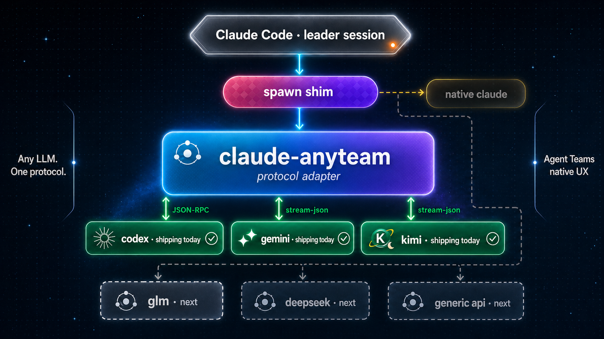

<div align="center">


### Native Claude Code teammates, any LLM.

**Codex and Gemini today.** Kimi, GLM, DeepSeek next — on the same team-native architecture.

[](LICENSE)
[](pyproject.toml)
[](npm/package.json)
[](#supported-backends)
[](tests)

[**Quickstart**](#quickstart) · [**Architecture**](docs/architecture.md) · [**Roadmap**](docs/roadmap.md)


</div>

---

## What it is

Claude Code's [Agent Teams](https://code.claude.com/docs/en/agent-teams) feature is built for multi-agent collaboration — but every teammate is a Claude instance. **claude-anyteam** makes it possible for *any* external agent harness to join the same team, with the same native UX, without wrapping it inside a Claude LLM.

Your Claude Code session orchestrates. External agents execute. No chat-wrapper overhead. No "Claude pretending to be Codex." No routers. Real agent CLIs, real teammates.

<p align="center">
  
</p>

## Quickstart

```bash
npx --yes claude-anyteam
```

That's the entire install. The installer:

- Detects `python3` and installs `uv` if missing (non-interactive, no shell profile edits)
- Installs the `claude-anyteam` Python tool via `uv tool install`
- Runs `claude-anyteam install` (verifies tmux/psmux, probes for the OpenAI Codex CLI and Gemini CLI, warns if either is missing or Codex is below 0.120, writes `~/.claude/settings.json` + `~/.claude.json`, records install-state for symmetric uninstall)

Restart Claude Code, enable Agent Teams mode, and create a teammate named `codex-<anything>` or `gemini-<anything>`:

```
codex-alice      → routed to claude-anyteam + Codex
codex-reviewer   → routed to claude-anyteam + Codex
gemini-alice     → routed to claude-anyteam + Gemini CLI
gemini-reviewer  → routed to claude-anyteam + Gemini CLI
alice            → native Claude (unchanged)
```

Codex- and Gemini-prefixed names appear in your TUI presence line exactly like native teammates. Single-terminal mode or tmux — both work.

## Why it feels native

<table>
<tr>
<td width="50%">

**Real teammate protocol**

Not a chat wrapper. The adapter speaks Claude Code's agent-team protocol directly: mailbox I/O, atomic task claims, idle notifications, shutdown lifecycle. A Codex teammate is functionally indistinguishable from a native Claude teammate.

</td>
<td width="50%">

**Mid-task reactivity**

When a peer messages a working teammate, the adapter injects the message mid-turn via Codex's `turn/steer` App Server call. Codex reshapes the in-flight turn instead of discarding it. v7.1.

</td>
</tr>
<tr>
<td width="50%">

**Cross-task memory**

Each new task forks from the previous task's Codex thread via `thread/fork`. The teammate carries its own conversational context forward across the team's task list. v7.3.

</td>
<td width="50%">

**Battle-tested parity**

348 passing tests. Ten parity bugs caught by a live 4-teammate hunt (mixed Claude + Codex) and fixed. Zero accepted limitations on the protocol layer.

</td>
</tr>
</table>

## Supported backends

| Backend | Teammate prefix | Status | Notes |
|---|---|---|---|
| Codex via OpenAI Codex CLI 0.120+ | `codex-*` | ✅ Supported today | App Server mode for mid-task steer and `thread/fork`; fresh-exec fallback with `codex exec resume`. |
| Gemini via Gemini CLI | `gemini-*` | ✅ Supported today | Default headless `gemini --prompt ... --output-format stream-json`, plus ACP via `gemini-anyteam --backend acp`; ACP supports `--trust default|plan` permission bridging and team-lead next-turn steer. See [Gemini adapter limitations](docs/gemini-adapter-limitations.md) for known gaps and trust caveats. |

## Coming next

| Coming next |
|---|
| ⏳ Kimi adapter |
| ⏳ GLM adapter |
| ⏳ DeepSeek adapter |
| ⏳ Generic CLI adapter template |

Codex and Gemini are shipping. Everything in "coming next" is on the same architectural surface — each new model is a new adapter binary + one line in the spawn shim's routing table. See [docs/roadmap.md](docs/roadmap.md).

## Requirements

- Python 3.12+
- Node 18+ (for the npm installer; not required at runtime)
- OpenAI Codex CLI 0.120+ on PATH for `codex-*` teammates
- Gemini CLI on PATH for `gemini-*` teammates
- Claude Code 2.1+ with Agent Teams mode
- Terminal multiplexer on PATH (tmux or psmux) — see [configuration.md](docs/configuration.md#teammate-display-mode)

## Docs

- [Install](docs/install.md) — how the installer wires Claude Code, alternative install methods, headless launches
- [Architecture](docs/architecture.md) — how the adapter integrates with Claude Code's team protocol
- [Roadmap](docs/roadmap.md) — supported today vs coming next, contribution pointers
- [Configuration](docs/configuration.md) — CLI flags, env vars, advanced modes
- [Releasing](docs/releasing.md) — maintainer-facing tag-triggered publish flow

## License

MIT
